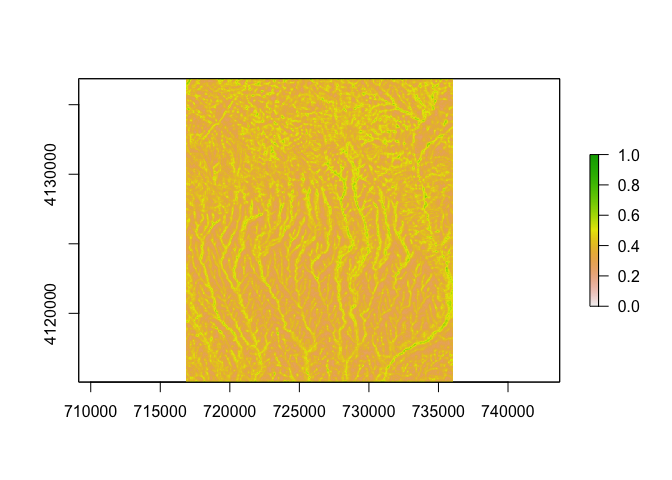

<!-- README.md is generated from README.Rmd. Please edit that file -->

# defense

<!-- badges: start -->
<!-- badges: end -->

The goal of defense is to implement the raster defensibility index as
reported in Bocinsky 2014.

The package contains a function calculating the extrinsic defensibility
for any position on a 30-meter DEM.

**NOTE: This has not been thoroughly tested, nor has it been generalized
to DEMs of other resolutions. Mileage may vary.**

> Bocinsky, R. Kyle
> [](https://orcid.org/0000-0003-1862-3428),
> (2014). Extrinsic site defensibility and landscape-based
> archaeological inference: An example from the Northwest Coast.
> *Journal of Anthropological Archaeology* 35: 164–176.
> <https://doi.org/10.1016/j.jaa.2014.05.003>

This defensibility index is a rasterization of one defined by Martindale
and Supernant (2009):

> Martindale, Andrew and Kisha Supernant, (2009). Quantifying the
> defensiveness of defended sites on the northwest coast of North
> America. *Journal of Anthropological Archaeology* 28(2):191–204.

## Installation

You can install the development version of defense from
[GitHub](https://github.com/) with:

``` r
# install.packages("devtools")
devtools::install_github("bocinsky/defense")
```

## Example

The `defense` package includes a 30 m DEM of Mesa Verde National Park
for testing. You might try to do something like this:

``` r
library(defense)

meve_di <-
  defense::meve %>%
  defense::di_calculate_defensibility_index()

meve_di
#> class      : RasterBrick 
#> dimensions : 727, 643, 467461, 3  (nrow, ncol, ncell, nlayers)
#> resolution : 30, 30  (x, y)
#> extent     : 716780.7, 736070.7, 4115058, 4136868  (xmin, xmax, ymin, ymax)
#> crs        : +proj=utm +zone=12 +datum=NAD83 +units=m +no_defs 
#> source     : memory
#> names      : defensibility, visibility, elevation 
#> min values :     0.2504158,  0.0000000, 0.3800069 
#> max values :     0.6601504,  0.8240741, 0.8062357

raster::plot(meve_di$defensibility, zlim = c(0,1))
```


